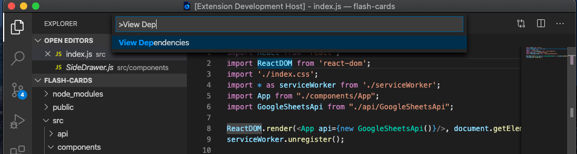
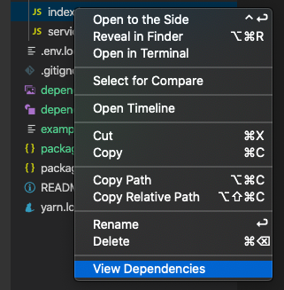

# Dependency Cruiser Extension

Check dependencies for any files quick and easy.


## Features

Pick any file, and run `View Dependencies` from the command palette. The extension will generate a Dependency Report and open that in a web View.



You Can also run the report from the content menu on any files:



Finally, you can click on each node, to open the file!

### Configuration options:

The extension supports configuration for generating the diagram:

-   **exclude**: Define a regex to exclude dependencies for being listed. Defaults to `node_modules/`
-   **maxDepth**: Define the maximun depth the cruiser will go into dependencies.
-   **layout**: Define the layout the diagram will use to display the tree. Defaults to `directed`
-   **prefix**: Prefix to add to each node URL. For example, you can use this to alllow opening the file in github.
-   **moduleSystems**: Define the module systems to be used. Supported: `['amd', 'cjs', 'es6', 'tsd']`. Defaults to `["amd", "cjs", "es6"]`
-   **tsConfig**: Specify the path for the typescript configuration file. Defaults to `tsconfig.json`
-   **webpackConfig**: Specify the path for the webpack configuration file. Defaults to `webpack.config.js`
-   **outputType**: The output type will specify the tree be generated. Allowed options are `top`, `folder` and `node`. Defaults to `node`

#### Exclude Options

Use exclude to optimize the diagram you want to build.

-   To include all the dependencies, just specify an empty string. **WARNING**: Consider adding `maxDepth` in the case where `node_modules` is not excluded to avoid vs code to freeze.

#### Layout Options

There are 7 layout options supported:

-   **directed**: raws directed graphs (dot).
-   **undirected**: draws undirected graphs using a ``spring'' model (neato).
-   **undirectedCompressed**: draws undirected graphs (fdp).
-   **clustered**: draws clustered graphs (osage).
-   **circular**: draws distributed circular layout around connected nodes (circo).
-   **radial**: draws graphs using a radial layout (twopi).
-   **treemap**: draws the graph as a squarified treemap (patchwork).
-   **themes**: Specify a theme for the graph.

For more detailed information check the [graphviz manual](https://graphviz.readthedocs.io/en/stable/manual.html#engines). You can also check [graphviz man pages](https://manpages.debian.org/stretch/graphviz/neato.1.en.html).

### OutputType Options

-   **top** will provide a high level dependencies overview
-   **folder** is similar to archi but will report sublevel folders
-   **node** is the default output reporter. It will generate a report based on leafs.

#### Webpack options

The `webpackConfig` configuration allows multiple options to be included. For example, you can specify environment variables and send arguments to webpack:

```
"options": {
  "webpackConfig": {
    "fileName": "webpack.config.js",
    "env": { "production": true },
    "arguments": { "mode": "production" }
  }
}
```

#### Theme options

You can specify different types of themes.

-   `basic`: default theme UI
-   `simple`: bare bones UI
-   `blueprint`: blueprint style
-   `flat`: flat UI style
-   `custom`: Specify your own custom style. When specifying custom, you will also need to provide the `customTheme` configuration with it. Learn more about configurations on the [Graphviz docs](https://www.graphviz.org/doc/info/attrs.html).

## Requirements

The extension needs at least Node.js 10.x to run.

## Known Issues

-   `node_modules` folder is currently excluded by default so no dependencies on external libraries will be listed. It is planned for 1.0.0
-   `webpack configuration` is not supported yet. It is planned for 1.0.0

Any other Known issue? We would really appreciate if you can [open a issue](https://github.com/juanallo/vscode-dependency-cruiser/issues).

## Release Notes

### 0.0.1

-   Generate a dependencies report from the command palette or from the context menu
-   Open a dependency by clicking on the node from the report.
